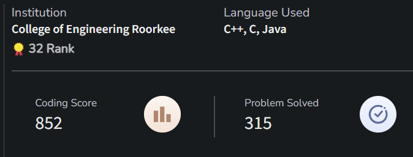
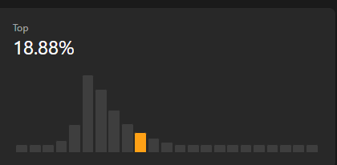

<!-- 👋 Greeting -->
# Hi there, I'm Praful!  
### 🚀 Full Stack Developer | Software Engineer 
---

## 🧑‍💻 About Me

I'm a **Software Engineer** with **1.5+ years of experience** at a **product-based company** — [SearchUnify (Grazitti Interactive)](https://www.searchunify.com/), where I’ve worked on multiple AI-powered enterprise products across full-stack and NLP domains.

---

## 🧠 My Work

### 🔹 **SUVA Chatbot – AI Chatbot Platform**
> A multi-platform, LLM-powered support chatbot

- Supported across platforms like **Salesforce, Zendesk**, and can be embedded in any webpage.
- ✨ Features:  
  - LLM-based responses (LangChain + OpenAI)
  - Case creation
  - Data-crawling based knowledge fetch
  - Voice-based interaction (Speech-to-Text & Text-to-Speech)
  - User analytics dashboard
- 🛠️ Tech Used: `Python`, `Flask`, `Langchain`, `OpenAI`, `Azure STT/TTS`, `Rasa`, `Redis`, `Kafka`, `Docker`, `Git`

---

### 🔹 **Knowbler – AI Assistant for Support Agents**
> An AI-powered solution to generate KB articles from support cases

- Supports integration with platforms like **Salesforce, ServiceNow, Zendesk**
- ✨ Features:  
  - Reads case subject, description, and comments
  - Auto-generates knowledge base articles
  - Real Time Updation of Cases and Articles
  - Powerful Admin Panel with detailed tracking of analytics
- 🛠️ Tech Used: `React`, `Node.js`, `Express`, `MongoDB`, `Kafka`, `Redis`, `Salesforce Apex`, `Salesforce LWC`, `Docker`, `Git`

---

## 🎯 What I'm Learning
- 🔭 Deep-diving into **LLMs, AI Integration in my Projects**, and **Micro Services Handling**
- 🌱 Currently Exploring **Large Data Handling ** and **CI/CD pipelines**
- 🧩 Practicing **DSA** on LeetCode & GeeksforGeeks
- 📊 Experience with **large data handling** using pagination, indexing, and aggregation pipelines
- 🧠 Follow **modular and scalable design principles** in product architecture

---

## 🛠️ Skills

### 💻 Languages & Programming

### 🌐 Frontend

### 🧠 Backend & APIs

### 🧠 AI & LLM Tools

### 🗄️ Databases & Messaging

### 🚀 DevOps & Tools

### ☁️ Salesforce

### 🧠 DSA

---

## 🧠 LeetCode, GFG & DSA Journey

## 🧠 GeeksforGeeks Stats

- 🧩 400+ problems solved
- 🎯 Ranked in **Top 18%**
- 🌱 Solving problems
- 💡 Favorite topics: Arrays, Trees, Graphs, LinkedList

---

## 📊 GitHub Stats

---

## 📫 Let's Connect

- 📧 Email: **guptapraful130@gmail.com**
- 💼 LinkedIn: [linkedin.com/in/praful-gupta](https://www.linkedin.com/in/praful-gupta)
- 🌐 Portfolio: [On the way, till then check this)[prafulthe85/JOB-Portal](https://github.com/prafulthe85/JOB-Portal)
- 🧑‍💻 GitHub: [github.com/prafulthe85](https://github.com/prafulthe85)

---

🔍 _“From solving DSA to building intelligent systems.”_
