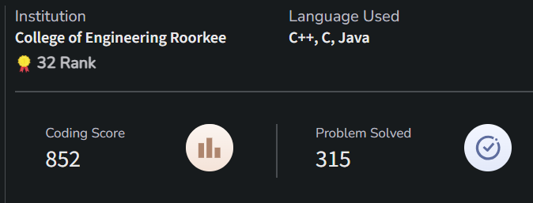
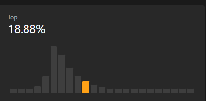

<!-- 👋 Greeting -->
# Hi there, I'm Praful!  
### 🚀 Full Stack Developer | Software Engineer 
---

## 🧑‍💻 About Me

I'm a **Software Engineer** with **1.9+ years of experience** at a  — **[Grazitti Interactive (SearchUnify)](https://www.searchunify.com/)**, currently building **Knowbler** (AI knowledge agent for support users) and previously worked on **SUVA Chatbot**, an AI-powered enterprise chatbot..

---

## 🔗 Happy to Connect😊

 &nbsp;&nbsp;
 &nbsp;&nbsp;
 &nbsp;&nbsp;
 : guptapraful130@gmail.com

## 🧠 My Work

### 🔹 **Knowbler – AI Knowledge App for Support Agents**
> An AI-powered platform that generates knowledge base articles directly from support cases.

- Integrated with enterprise platforms such as **Salesforce, ServiceNow, Zendesk, Khoros, and FreshService.**
- ✨ Key Features:  
  - Extracts and analyzes case subjects, descriptions, and comments.
  - Automatically generates and updates knowledge base articles.
  - Real-time synchronization of cases and articles.
  - Provides a comprehensive admin dashboard with detailed analytics, visual graphs, and tracking.
- 🛠️ Tech Used: `React`, `Node.js`, `ExpressJs`, `MongoDB`, `Kafka`, `Redis Caching`, `MicroServices-Architechure`, `Salesforce Apex`, `Salesforce LWC`, `Docker`, `Git`, `OAuths`, `Nginx`, `GraphQL`

---

### 🔹 **SUVA Chatbot – AI Chatbot Platform**
> A multi-channel, LLM-powered chatbot designed for intelligent customer support.

- Deployed across platforms like **Salesforce and Zendesk**, with embeddable support for any web application.
- ✨ Features:  
  - LLM-driven conversational responses using LangChain and OpenAI.
  - Automated case creation and ticket handling.
  - Knowledge retrieval through data crawling and indexing.
  - Voice-enabled interactions using Speech-to-Text and Text-to-Speech.
  - User behavior analytics and performance dashboards.
- 🛠️ Tech Used: `Python`, `Flask`, `Langchain`, `OpenAI`, `Azure STT/TTS`, `Rasa`, `Redis`, `Kafka`, `Docker`, `Git`

---

## 🎯 What I'm Learning
- 🔭 Expanding expertise in **LLMs**, **AI integrations**, and **microservices-based systems**.
- 🌱 Learning **scalable data handling** techniques and **CI/CD automation**.
- 🧩 Actively strengthening **DSA problem-solving skills** at Leetcode and GeeksForGeeks.
- 📊 Applying modular and scalable design principles in real-world products.

---

## 🛠️ Skills

### 💻 Languages & Programming

### 🌐 Frontend

### 🧠 Backend & APIs

### 🧠 AI & LLM Tools

### 🗄️ Databases & Messaging

### 🚀 DevOps & Tools

### ☁️ Salesforce

### 🧠 DSA

---

## 🧠 LeetCode, GFG & DSA Journey

## 🧠 GeeksforGeeks Stats

- 🧩 400+ problems solved
- 🎯 Ranked in **Top 18%**
- 🌱 Solving problems
- 💡 Favorite topics: Arrays, Trees, Graphs, LinkedList

---

## 📊 GitHub Stats

---

🔍 _“From solving DSA to building intelligent systems.”_
